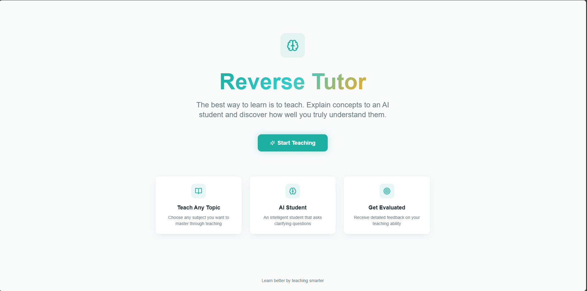
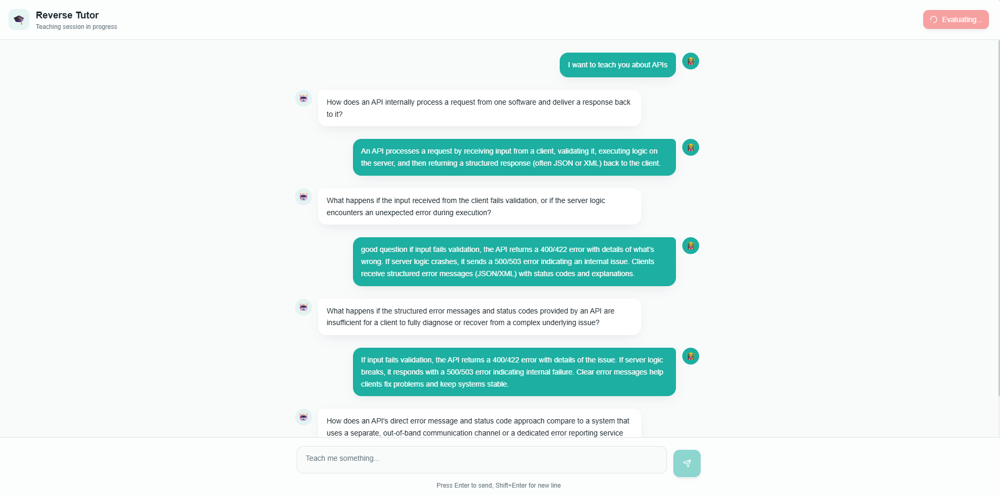
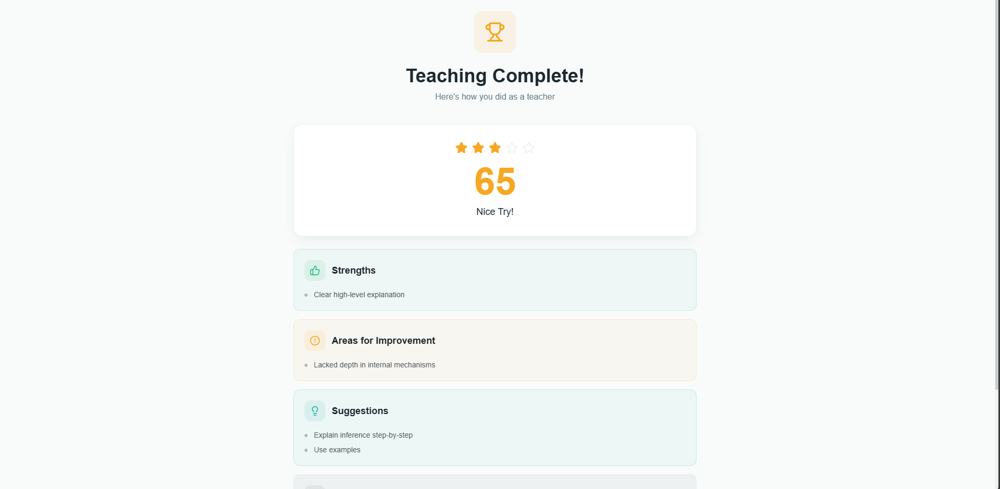

# 🎓 Reverse Tutor — Learn by Teaching

Reverse Tutor is an AI-powered learning platform that flips the traditional tutoring model.

Instead of the AI teaching the user, **the user teaches the AI**.
The AI behaves like a **curious student**, continuously asking **deep, conceptual questions** to challenge the teacher’s understanding.

This project is inspired by the **Feynman Technique** — *the best way to learn something is to teach it*.

---

## 🚀 Core Idea

> If you can clearly explain a concept and handle probing questions, you truly understand it.

Reverse Tutor enforces this by:

* Making the user explain concepts
* Having the AI ask *How / Why / What-if* questions
* Providing a final evaluation of teaching quality

---

## ✨ Features

* 🧠 **AI Student (Gemini API)**
  The AI acts strictly as a student and asks only one deep question at a time.

* 🔄 **Session-Based Teaching Flow**
  Each teaching session is tracked using a unique `session_id`.

* 💬 **Chat-Based Learning Interface**
  Clean, interactive UI for teaching and answering questions.

* 📊 **Teaching Evaluation**
  At the end of the session, the AI evaluates:

  * Concept clarity
  * Logical flow
  * Depth of understanding
  * Handling of edge cases

* 🛑 **Graceful Fallback System**
  If the Gemini API is unavailable or rate-limited, the system falls back to a deterministic questioning engine.

---

## 🖼️ Screenshots

> 📌 **Add screenshots by placing images inside a `screenshots/` folder in the root of the repo.**

### 🏠 Home Page



### 💬 Teaching Chat Interface



### 📊 Teaching Evaluation (End Session)



---

## 🏗️ Tech Stack

### Frontend

* React + TypeScript
* Vite
* Tailwind CSS
* ShadCN UI
* Fetch API

### Backend

* FastAPI (Python)
* Google Gemini API
* Pydantic
* Uvicorn

---

## 📁 Project Structure

```
Gemini-Hackathon/
│
├── backend/
│   ├── main.py
│   ├── routes/
│   │   ├── session.py
│   │   └── chat.py
│   ├── services/
│   │   ├── gemini_service.py
│   │   ├── session_manager.py
│   │   └── evaluation_engine.py
│   ├── models/
│   │   ├── session.py
│   │   └── chat.py
│   ├── requirements.txt
│   └── .gitignore
│
├── frontend/
│   ├── src/
│   │   ├── components/
│   │   ├── pages/
│   │   ├── hooks/
│   │   └── types/
│   ├── package.json
│   ├── vite.config.ts
│   ├── tailwind.config.ts
│   └── .gitignore
│
├── screenshots/
│   ├── home.png
│   ├── chat.png
│   └── evaluation.png
│
└── README.md
```

---

## 🔄 Application Flow

### 1️⃣ Start Teaching Session

```
POST /session/start
```

* Creates a new teaching session
* Returns a unique `session_id`

---

### 2️⃣ Teach the AI (Chat)

```
POST /chat
```

**Request Body**

```json
{
  "session_id": "uuid",
  "message": "User explanation"
}
```

* User explains a concept
* AI responds with **exactly one deep question**
* Conversation history is stored per session

---

### 3️⃣ End Teaching & Get Evaluation

```
POST /session/end_teaching?session_id=uuid
```

* AI evaluates the teaching quality
* Session is cleaned up
* Structured evaluation is returned

---

## 🧠 AI Behavior Rules

The AI is strictly constrained to behave as a **student**:

* Asks **exactly one question**
* Question must start with:

  * `How`
  * `Why`
  * `What happens if`
* No explanations
* No summaries
* No multiple questions

This ensures **active learning**, not passive consumption.

---

## ⚠️ Error Handling & Fallbacks

* Handles Gemini API rate limits
* Prevents truncated responses
* Shows debug errors during development
* Falls back gracefully if Gemini is unavailable

---

## 🧪 Running the Project Locally

### Backend Setup

```bash
cd backend
pip install -r requirements.txt
uvicorn main:app --reload
```

Backend runs at:

```
http://localhost:8000
```

---

### Frontend Setup

```bash
cd frontend
npm install
npm run dev
```

Frontend runs at:

```
http://localhost:8080
```

---

## 🔐 Environment Configuration

Create a config file (do NOT commit it):

```python
# backend/config.py
GEMINI_API_KEY = "your_api_key_here"
```

---

## 🎯 Use Cases

* Learning complex concepts
* Interview preparation
* Teaching skill assessment
* Self-evaluation of understanding
* EdTech experimentation

---

## 🏁 Conclusion

Reverse Tutor transforms AI from a **teacher into a student**, forcing users to explain, justify, and refine their understanding.

This results in **deeper learning, better retention, and measurable insight into conceptual mastery**.

---

